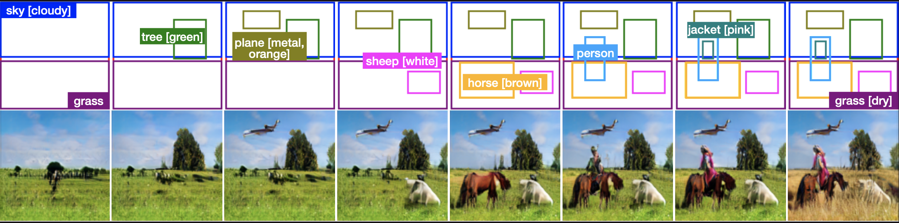
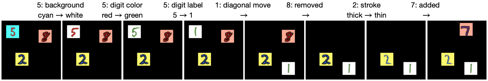

# AttrLostGAN

Official implementation of the paper [AttrLostGAN: Attribute Controlled Image Synthesis from Reconfigurable Layout and Style](https://arxiv.org/abs/2103.13722),
a method for attribute controlled image synthesis from layout which allows to specify the
appearance of individual objects.

**Authors:** Stanislav Frolov, Avneesh Sharma, Jörn Hees, Tushar Karayil, Federico Raue, Andreas Dengel

**Contact:** stanislav.frolov@dfki.de

## Example on Visual Genome
Generated images using a reconfigurable layout and atttributes to control the appearance of individual objects. From left to right:
add tree [green], add plane [metal, orange], add sheep [white], add horse [brown], add person, add jacket [pink], grass → grass [dry].



## Example on MNIST Dialog
We created a synthetic dataset based on [MNIST Dialog](http://cvlab.postech.ac.kr/research/attmem/) to study our approach.
Each image contains multiple randomly placed digits on a black background, and each digit has multiple attributes
(digit color, background color, and stroke style). From left to right we modify the specification of individual objects
without affecting the rest of the image which enables controllable image generation.
See paper for more details.



## Getting Started

- Python 3.6
- PyTorch 1.5

```
# clone repository
git clone https://github.com/stanifrolov/attrlostgan.git

# install requirements
pip install -r requirements.txt

# setup for roi_layers
python setup.py build develop

# download Visual Genome dataset to `datasets/vg` 
bash scripts/download_vg.sh
python scripts/preprocess_vg.py
```

## Generator Checkpoints & MNIST Dialog Dataset

Download the following checkpoints to `./pretrained` in order to use the demo notebooks.

#### Visual Genome
- [AttrLostGANv1 128x128](https://drive.google.com/file/d/1rSAtWZcXnuGRDIfoT4iliydE7Mhe1zIE/view?usp=sharing)
- [AttrLostGANv2 128x128](https://drive.google.com/file/d/1OGq20ttPKGciqtH8Toyz65nSq2uR7U8X/view?usp=sharing)
- [AttrLostGANv2 256x256](https://drive.google.com/file/d/1uvbWK5eOrPtozDw3itj1q1zDtCkF1M_F/view?usp=sharing)
- [Method by Ke Ma et al.](https://drive.google.com/file/d/1Lq9vCi4kwqocGjb6ug-26kwZFTp3k8I8/view?usp=sharing) using [Attribute-guided Layout2Im](https://github.com/ubc-vision/attribute-guided-image-generation-from-layout)

#### MNIST Dialog
- [Model](https://drive.google.com/file/d/1pdRILJn88AC0iJMcGzXkEthj0LLjzeKO/view?usp=sharing)
- [Dataset](https://drive.google.com/file/d/17fxPXXtSVEvh4jYU-VLtcCUe_VXHzOBv/view?usp=sharing)

## Demo Jupyter Notebooks
We provide two notebooks to play around with the pre-trained models in an interactive way.

- [dmnist_demo.ipynb](dmnist_demo.ipynb) for the model trained on MNIST Dialog
- [demo.ipynb](demo.ipynb) for the models trained on Visual Genome (version and image size can be configured)


## Training & Testing

#### Visual Genome

```
python train.py --version=<1 or 2> --img_size=<128 or 256>

python test.py --version=<1 or 2> --img_size=<128 or 256> --split=<train, val or test> --model_path=<path to model>
```

#### MNIST Dialog

```sh
python dmnist_train.py --dataset_path=<path to dataset>

python dmnist_test.py --dataset_path=<path to dataset> --model_path=<path to model>
```

## Evaluation on Visual Genome

#### 1. IS and SceneIS
To compute the IS on images and SceneIS on object crops we used the official TensorFlow implementation at [openai/improved-gan](https://github.com/openai/improved-gan)
and TensorFlow version 1.15.3.

```
# IS
python ./eval/is.py --num_images=5096 --splits=5 --image_folder=<path to images>

# SceneIS
python ./eval/is.py --num_images=30000 --splits=10 --image_folder=<path to object crops>
```

#### 2. FID and SceneFID
To compute the FID between real and fake images, and SceneFID between real and fake object crops we used the official TensorFlow implementation at [bioinf-jku/TTUR](https://github.com/bioinf-jku/TTUR)
and TensorFlow version 1.15.3.
```
# FID
python ./eval/fid.py --size=<image size 128 or 256> <path to fake images> <path to real images>

# SceneFID
python ./eval/fid.py --size=128 <path to fake images> <path to real images>
```

#### 3. LPIPS
To compute the Diversity Score (DS) we used the official implementation at [richzhang/PerceptualSimilarity](https://github.com/richzhang/PerceptualSimilarity)

#### 4. CAS
The results in our paper are obtained by first training an object label classifier on fake data, and then reporting the test accuracy
of the model with the lowest validation loss (both val and test on real data).

```
# step 1: train the classifier
python ./eval/resnet_object_classifier.py \
--train_path=<path to samples generated from train split> \
--val_path=<path to samples generated from val split> \
--test_path=<path to samples generated from test split> \
--model_name=resnet101 --feature_extract --total_epoch=20 --batch_size=256

# step 2: report test accuracy with the lowest validation loss using the log file
```

#### 5. Attr-F1
The results in our paper are obtained by first training a (multi-label) attribute classifier on fake data, and then
reporting the test micro-F1 score of the model with lowest validation loss (both val and test on real data).

```
# step 1: train the classifier
python ./eval/resnet_attribute_classifier.py \
--train_path=<path to samples generated from train split> \
--val_path=<path to samples generated from val split> \
--test_path=<path to samples generated from test split> \
--model_name=resnet101 --feature_extract --total_epoch=20

# step 2: choose test predictions with the lowest validation loss using the log file

# step 3: compute Attr-F1
python ./eval/attr_f1.py --path=<path_to_csv>
```

## Acknowledgements
This works builds upon [LostGAN-v1](https://arxiv.org/abs/1908.07500) and [LostGAN-v2](https://arxiv.org/abs/2003.11571),
using the [official implementations](https://github.com/WillSuen/LostGANs).
We also used the code of [Attribute-guided Layout2Im](https://github.com/ubc-vision/attribute-guided-image-generation-from-layout) to train a baseline.
Furthermore, we used open-source implementations of evaluation metrics such as [IS](https://github.com/openai/improved-gan), [FID](https://github.com/bioinf-jku/TTUR), and [LPIPS](https://github.com/richzhang/PerceptualSimilarity).

## Citation
If you found this research useful please consider citing:

```
@article{frolov2021attrlostgan,
  title={AttrLostGAN: Attribute Controlled Image Synthesis from Reconfigurable Layout and Style},
  author={Frolov, Stanislav and Sharma, Avneesh and Hees, J{\"o}rn and Karayil, Tushar and Raue, Federico and Dengel, Andreas},
  journal={arXiv preprint arXiv:2103.13722},
  year={2021}
}
```
